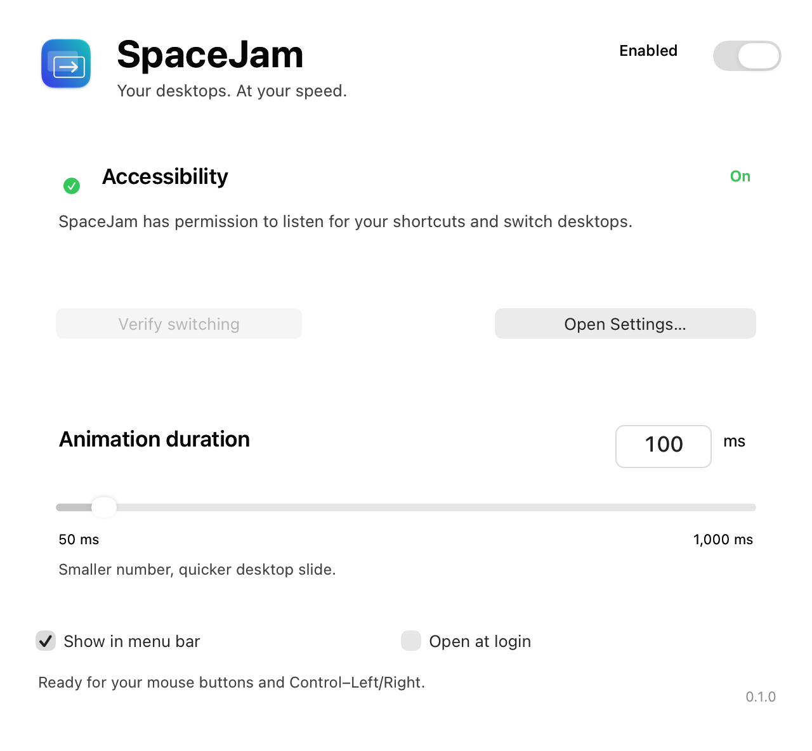
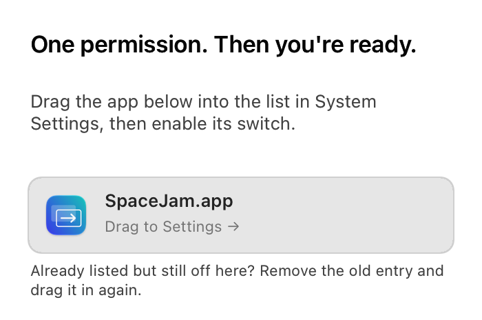

# SpaceJam

**Your desktops. At your speed.**

Choose how quickly your Mac slides between desktops. SpaceJam works with
**Control–Left/Right** and mouse buttons mapped to those shortcuts.



## Install

**Apple silicon · macOS 27 · at least two ordinary desktops**

Downloads are Developer ID signed and notarized by Apple.

1. [Download the latest DMG](https://github.com/rkaregaran/SpaceJam/releases/latest).
2. Open it and drag **SpaceJam** into **Applications**.
3. Open SpaceJam. Click **Open Settings…**, drag the app tile into the permission
   list, and enable its switch. macOS may ask for Touch ID or your password.
4. Choose a duration. **100 ms** is the default; try **75 ms** for a quicker slide.



The permission page is under **Privacy & Security**. On macOS 27 it may be
called **Device Control and Data Access** rather than Accessibility. SpaceJam
checks the grant automatically and shows its status at the top of settings.

### Homebrew

```sh
brew tap rkaregaran/spacejam https://github.com/rkaregaran/SpaceJam
brew install --cask spacejam
```

### Terminal

```sh
/bin/bash -c "$(curl --fail --show-error --silent --location --proto '=https' https://raw.githubusercontent.com/rkaregaran/SpaceJam/main/scripts/install.sh)"
```

The installer verifies the release checksum, app signature, and Gatekeeper
approval before copying the app into Applications. It may ask for your Mac
password to write there. It leaves an existing installation intact.

## Use

- Choose **50–1,000 ms** and toggle **Enabled** to pause or resume.
- **Verify switching** moves to a neighboring desktop and returns.
- Closing settings keeps SpaceJam running. **Quit SpaceJam** stops it.
- Turn off **Show in menu bar** for a quieter desktop. Reopen the app from
  Applications to bring settings back.
- Enable **Open at login** to start it automatically after signing in.

Physical trackpad swipes, numbered desktop shortcuts, Mission Control, and
fullscreen desktop transitions retain their native behavior. This release
changes ordinary desktop switching through Control–Left/Right.

## How it works

The released **v0.1.0** app turns Control–Left/Right into a synthetic horizontal
swipe with a configurable duration. macOS still performs the desktop transition;
SpaceJam supplies the gesture's progress and ending velocity.

### Mechanism

1. **Intercept the shortcut.** With your Accessibility grant, SpaceJam installs
   a session-level CoreGraphics event tap (`CGEventTapCreate`). It reads keycodes
   and modifiers to recognize Control–Left/Right, including mouse buttons mapped
   to those keys. When it can handle a switch, it suppresses that shortcut's key
   events so the native shortcut does not trigger a second transition.
2. **Find the destination.** It selects the display under the pointer and reads
   its desktop list and active desktop through private SkyLight functions,
   including `SLSCopyManagedDisplaySpaces` and
   `SLSManagedDisplayGetCurrentSpace`. Only adjacent ordinary desktops are
   handled; fullscreen Spaces and detected Mission Control use native switching.
3. **Send a gesture.** The engine adapted from Matthew Bowen's
   [FasterSwiper](https://github.com/mgbowen/FasterSwiper) constructs a private
   fluid-swipe IOHID payload, embeds it in serialized CoreGraphics events, and
   posts Begin, Changed, and End phases with `CGEventPost`. A nominal 240 Hz
   run-loop timer advances a quadratic ease-out curve over your selected
   **50–1,000 ms**. Natural scrolling is accounted for, and events are tagged so
   SpaceJam can distinguish its own gestures from physical input. This controls
   the requested gesture trajectory; timer scheduling and macOS settling can
   make the visible transition take longer.
4. **Check the result.** After End, it polls the active desktop ID for up to
   **300 ms**. Another queued move starts only after the expected destination
   is confirmed. If confirmation fails, the listener stops and reports that
   SpaceJam is paused.

The implementation is in [SwitchEngine.mm](Sources/SwitchEngine.mm) and
[GestureEvents.h](Sources/ThirdParty/GestureEvents.h).

### Permissions, safeguards, and risks

- **Accessibility is a broad trust grant.** It permits an app to observe input
  and control your Mac; macOS does not restrict this grant to desktop shortcuts.
  The event tap receives session keyboard events, but SpaceJam's keyboard handler
  uses keycodes, modifiers, and repeat state rather than recording typed text.
  Desktop detection reads display/desktop IDs and on-screen window metadata
  (owner, layer, and bounds), without capturing screen images.
  The app has no input log, analytics, or runtime network requests. Settings are
  stored locally in `NSUserDefaults`. Grant access only to a copy you trust;
  see [Apple's explanation of Accessibility access](https://support.apple.com/guide/mac-help/mh43185/mac).
- **SIP and Gatekeeper stay enabled.** The running app needs no root access,
  Dock patch, process injection, or system-file modification. It acts through
  your logged-in session's input APIs. The installer may need administrator
  permission to copy the app into `/Applications`; runtime switching does not.
- **Private APIs can break.** SkyLight functions, desktop metadata, gesture
  fields, and event serialization are undocumented implementation details.
  Even a macOS 27 update can change them. Startup checks reject unsupported
  serialization, and unhandled initial shortcuts pass through to macOS, but
  these checks cannot guarantee correct behavior after every OS update.
- **Input can be dropped or interrupted.** Up to six additional moves are
  queued; excess presses and handled-key autorepeat are discarded. A queued
  move that becomes unsupported is discarded. A failure after a shortcut has
  been consumed does not replay it, so you may need to press again. A physical
  swipe cancels an active synthetic gesture. Other input utilities may also
  interfere, and a bug or protocol change could leave a transition incomplete
  or move to an unexpected desktop.
- **Stopping is reversible.** Pausing, quitting, sleep, and display changes
  cancel pending work and remove the event tap; waking or a display change may
  restart it if enabled. Permission revocation is checked every second while
  settings is visible and every ten seconds otherwise. To recover, turn off
  **Enabled** or quit SpaceJam; revoke its grant in System Settings to remove
  its authorization. There is no persistent system animation patch to undo.
- **Signing is not a compatibility guarantee.** Developer ID signatures and
  Apple notarization provide distribution checks. [Notarization is not App
  Review](https://developer.apple.com/documentation/security/notarizing-macos-software-before-distribution)
  and does not establish that this private gesture mechanism is supported or
  bug-free. Recorded live checks cover macOS **27.2 build 26B5091g**, including
  desktop round trips at 75 and 100 ms with SIP enabled. Broader display,
  fullscreen, sleep/wake, and permission-revocation checks remain listed in
  [the validation record](docs/VALIDATION.md).

## Build & contribute

With Apple's command line tools and SDK 27 on an Apple silicon Mac:

```sh
python3 scripts/build.py
```

See [development notes](docs/DEVELOPMENT.md) and
[signed releases](docs/RELEASING.md). No Bazel, Bazelisk, or runtime package
dependencies are required.

App interface, settings, packaging, and documentation: **MIT**. The adapted
gesture engine is **Apache-2.0**, with credit to Matthew Bowen's
[FasterSwiper](https://github.com/mgbowen/FasterSwiper).
See [license details](THIRD_PARTY_NOTICES.md).
